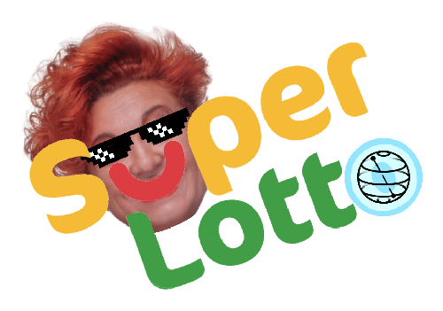

# Wanna Fortune Teller - aka  "Super Lotto"

# Introduction

Have you ever thought about using quantum computers to predict the lottery numbers? Well, this might sound like a joke, but with the advancement in quantum technology, this could become a reality someday.

In this project, I will be showcasing a small example of how quantum computers can be used to generate random numbers. The code uses IBM Quantum Lab and the open-source framework, Qiskit, to simulate the quantum circuit.

### Cultural Background

The project is inspired by a character that is now part of Italian popular folklore, signora. Wanna. For those who don't know, signora Wanna was a brilliant television salesperson who worked in the field from the 70s to the early 2000s. During her last years of her career, she became famous for selling "lucky numbers" to play on the national lottery. This, along with other behaviors, led to her arrest and conviction. If you want to learn more about her, you can search for information on Wikipedia or the internet.

### The Code

The code creates a quantum register of 6 qubits and a classical register of 6 bits. It then uses the Hadamard gate to extract random numbers. The Hadamard gate maps the qubits to a superposition of 0 and 1, effectively creating a random number.

Once the circuit has been executed, the results are extracted and mapped to a range of numbers between 1 and 90, which can be used as lottery numbers. The code then selects 6 unique numbers from this range and prints them as the final output.

### The Experiment

It is important to note that this experiment is not meant to be taken seriously and its purpose is to demonstrate the concept of using quantum computers to generate random numbers. The actual accuracy of this experiment in predicting lottery numbers is purely coincidental.

Despite its limitations, it can be fun to see how close the numbers generated by this code come to the actual lottery numbers. It serves as a great educational tool for those who are interested in learning about quantum computing and its potential applications.

In conclusion, while this experiment might not lead to a big win in the lottery, it provides a glimpse into the world of quantum computing and the possibilities it holds for the future.

### Conclusion

While this project is meant to be lighthearted and entertaining, it is worth noting that if someone were to use this code to actually win a lottery prize, it would be a nice gesture to donate a portion of the winnings.
